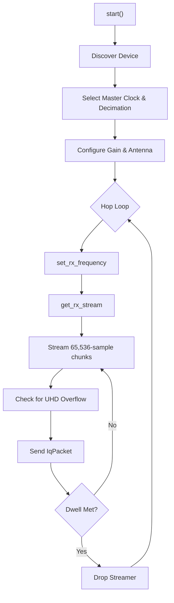

# Design: Ettus USRP Interface (sdr-usrp-rs)

This document outlines the architecture of the `sdr-usrp-rs` crate, providing integration with Ettus Research USRP devices (primarily the B210 and B205mini) via the `uhd` Rust bindings.

## 1. Introduction

The USRP B210 is the recommended SDR for high-fidelity detection in SDR detection applications due to its 12-bit ADC, excellent dynamic range, and USB 3.0 throughput. This crate wraps the `uhd` 0.3 crate (targeting UHD 4.x), implementing dynamic channel hopping, decimation strategies, and proactive buffer overrun mitigation.

## 2. System Architecture

The backend isolates the UHD streamer in a dedicated, high-priority capture thread.

### The Borrow Checker Constraint
The `uhd` crate strictly models hardware state lifetimes. Both `Usrp::get_rx_stream()` and `Usrp::set_rx_frequency()` require `&mut self`. Because the `ReceiveStreamer` holds this mutable borrow, the orchestrator cannot tune the frequency while the streamer exists.
- **Resolution**: The capture thread deliberately drops and recreates the `ReceiveStreamer` on every channel hop. While this incurs a minor setup penalty, it safely satisfies Rust's memory model without dropping to unsafe C FFI `uhd-sys` calls.

## 3. Clock and Decimation Strategy

To maximize ADC resolution, the USRP operates best when the master clock rate is a high integer multiple of the requested sample rate.
- The backend automatically searches for the highest integer decimation factor (up to 4×) that keeps the master clock within the B210's 61.44 MHz ceiling.
- E.g., for a 15.36 MSPS request, the backend sets the master clock to 61.44 MHz and requests a decimation of 4. Each 4× oversampling step effectively buys ~1 bit of extra ADC resolution, lowering the noise floor.

## 4. Overrun Mitigation and Adaptive Tuning

Operating at high sample rates (e.g., 50 MSPS) over USB 3.0 risks saturating the host's USB controller, causing hardware buffer overflows (indicated by `O` characters in UHD stdout).

### Hardware Overrun Flags
When `streamer.receive()` returns `ReceiveErrorKind::Overflow`, the backend sets `IqPacket::overrun = true`. This metadata allows the downstream worker pool to gracefully discard corrupted DSP frames.
